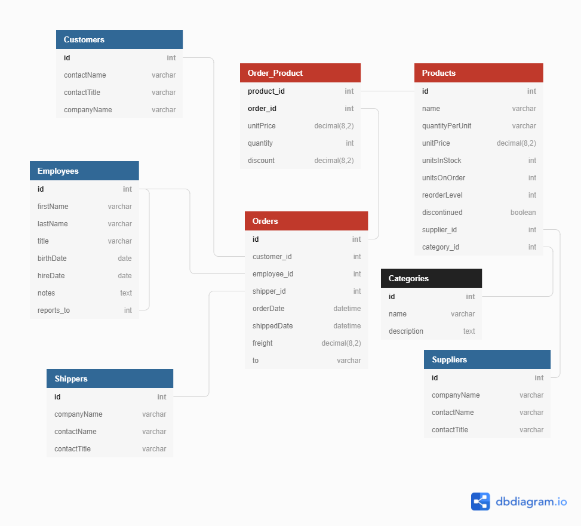

# Northwind Nextjs

Esta é uma app totalmente funcional baseada na aplicação Northwind do antigo Microsoft Access

Demo: https://northwind-nextjs.vercel.app/


## Database




## Install


```
$ git clone https://github.com/danielschmitz/northwind-nextjs.git
cd northwind-nextjs
npm install
```

Create a database at elephantsql.com (or use your postgreSQL instance...)

Copy `.env.example` to `.env`. Fill DB_HOST, DB_USER.....

```
$ npm run migrate
```

PS: Every time you run `npm run mugrate` the data will be erased to default. Dont use `npm run migrate` in the production servers
